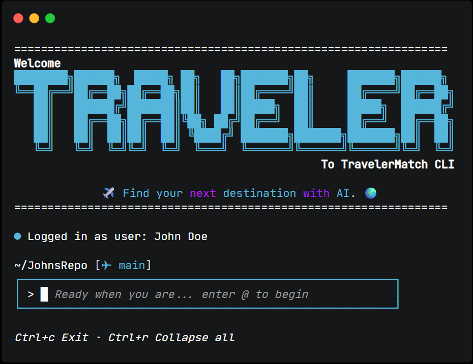

# ✈️ TravelerMatch

TravelerMatch is a CLI based travel recommendation engine that helps users discover personalized travel destinations based on their preferences. Using NLP the platform takes in user constraints, preferences, and real-time weather data to provide personalized travel destination rankings. 



## 🚀 Features
1. **AI-Powered Recommendations:** Uses Google's Gemini API to generate personalized destination recommendations based on user preferences.
2. **Smart Interest Mapping:** Converts natural language interests (e.g., "I like hiking and nature") into standardized destination tags.
3. **Jaccard Similarity Scoring:** Measures overlap between a user's interests and each destination's associated interests.
4. **Intelligent Caching:** Previously generated recommendations are cached using a canonical query hash, significantly reducing duplicate Gemini API calls.
6. **User-Friendly CLI:** Simple terminal interface that guides users through trip planning with suggested climates and interests.


## 🎯 How It Works 
1. **Frontend (CLI):** Custom ASCII art interface prompting users for their travel preferences.
2. **Backend:** Built with Python, manages recommendation pipeline, API calls, response caching, & database operations.
3. **API Integrations:** Integrates the Open-Meteo API for real-time weather forecasts and the Google Gemini API to normalize user interests and generate personalized destination recommendations.
4. **Database Filtering:** Uses SQLite to store and filter destinations based on user-selected constraints such as budget and climate before ranking.
5. **Destination Ranking:** Computes the Jaccard Similarity score between the user's normalized interests and each destination's associated interests to identify the best matches.

## ⚙️ Setup

Before running TravelerMatch, you'll need to configure a few environment variables.

### 1. Create a `.env` File

In the project's root directory, create a file named `.env` with the following contents:

```env
DATABASE_URL=sqlite:///traveler_match.db
GEMINI_API_KEY=your_gemini_api_key_here
```

> **Note:** The SQLite database file (`traveler_match.db`) will automatically be created in the project's root directory the first time the application runs.

### 2. Obtain a Gemini API Key

1. Visit **Google AI Studio**: https://aistudio.google.com/
2. Sign in with your Google account.
3. Navigate to **API Keys**.
4. Create a new API key.
5. Copy the key and replace:

```env
GEMINI_API_KEY=your_gemini_api_key_here
```

with your generated API key.

### 3. Install Dependencies

```bash
pip install -r requirements.txt
```

### 4. Run the Application

```bash
python main.py
```

On the first run, TravelerMatch will automatically:

* Create the SQLite database.
* Initialize all required tables.
* Seed the destination and interest data.
* Cache future recommendation results to reduce Gemini API usage.
